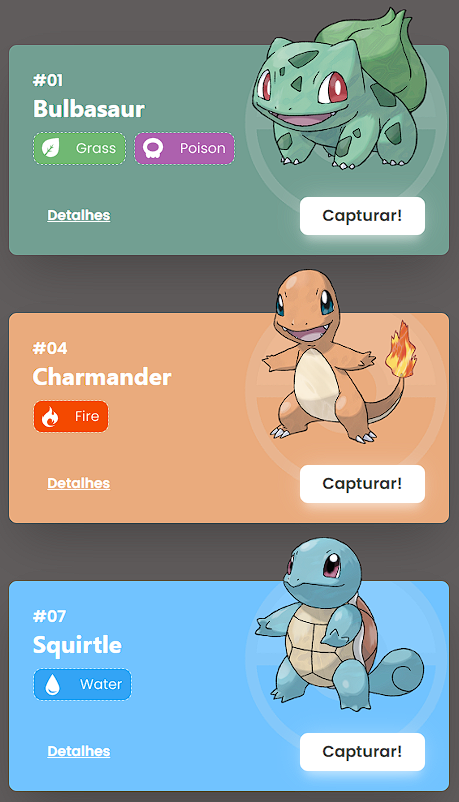
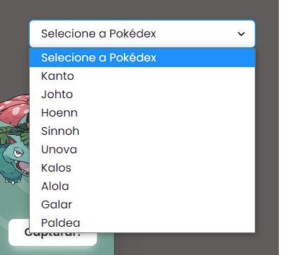
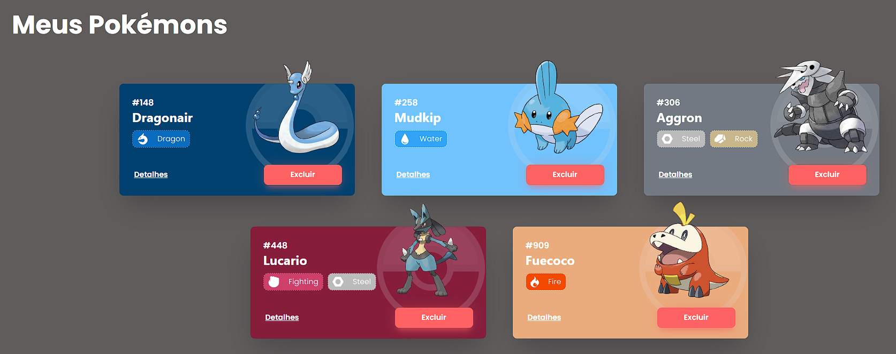
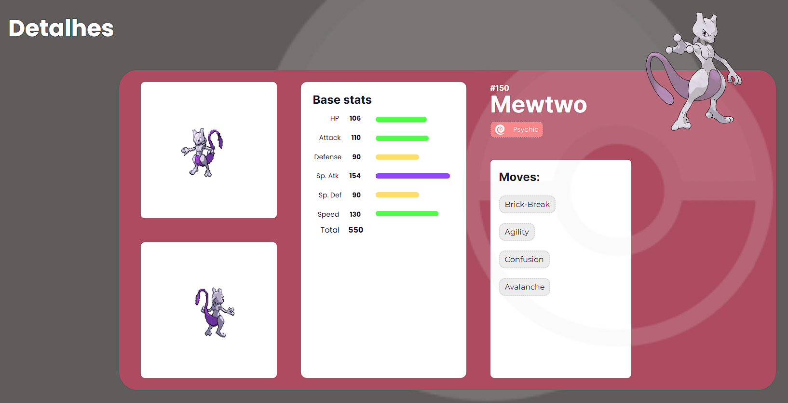

# Projeto Pokédex

Uma Pokédex completa que renderiza todos os pokémons da [PokeAPI](https://pokeapi.co/)

## índice
- <a href="#funcionalidades-do-projeto">Funcionalidades do Projeto</a>
- <a href="#layout">Layout</a>
- <a href="#demonstração">Demonstração</a>
- <a href="#como-rodar-este-projeto">Como rodar este projeto?</a>
- <a href="#tecnologias-utilizadas">Tecnologias Utilizadas</a>
- <a href="#pessoas-autoras">Pessoas Autoras</a>
- <a href="#próximos-passos">Próximos Passos</a>

## Funcionalidades do Projeto

- [x] Home com diversas Pokédexes das respectivas gerações
- [x] Pokédex pessoal totalmente interativa, podendo adicionar e remover qualquer pokémon
- [x] Visualização de detalhes de mais de 1.000 pokémons

## Layout
### Home
Cards interativos personalizados de acordo com o tipo primário do pokémon


Lista selecionável com todas as regiões do universo Pokémon e seus respectivos pokémons, contendo mais de 1.000 pokémons


### Pokédex Pessoal
Renderização da lista de pokémons escolhidos pelo usuário


Caso o usuário não tenha selecionado nenhum pokémon, a página não fica vazia.
Nesse caso é carregado uma mensagem para sinalizar o usuário


### Detalhes
Visualização dos detalhes do pokémon, sendo totalmente personalizado, com cores de fundo respectivas do tipo do pokémon.
Contém também barras de status que aumentam e diminuem de acordo com o poder do pokémon e uma lista com algumas das habilidades disponíveis para aquele pokémon, sendo essas sempre diferentes, mostrando ao usuário novas informações caso acesse novamente


### Página de Erro
Caso o usuário tenha algum problema na navegação de páginas, foi criado uma página de erro na qual ele pode retornar para a Home ao clicar


## Demonstração
Link para acessar o site:
[Deploy Pokédex](https://pokedex-lucastavaresdev.vercel.app/)

## Como rodar este projeto?

```bash
# Clone este repositório
$ git clone (link-do-repo)

# Acesse a pasta do projeto no seu terminal
$ cd pokedex

# Instale as dependências
$ npm install

# Execute a aplicação
$ npm run start

# A aplicação será iniciada na porta 3000, acesse pelo navegador: http://localhost:3000
```

## Tecnologias Utilizadas
1. [React](https://pt-br.reactjs.org/)
2. [Styled Components](https://styled-components.com/)
3. [React Router](https://reactrouter.com/en/main)
4. [Axios](https://axios-http.com/ptbr/docs/intro)
5. [Chakra](https://chakra-ui.com/)

## Pessoas Autoras


[LinkedIN](https://www.linkedin.com/in/-lucas-tavares/)

## Próximos Passos
- [] Tornar o layout responsivo para dispositivos móveis
- [] Salvar Pokédex pessoal no LocalStorage
- [] Implementar sistema de login
- [] Exibir, nos Detalhes, linha evolutiva do pokémon e também transformações, como Mega Evoluções, Gigantamax e Terastallize
- [] Exibir, nos Detalhes, fraquezas e vantagens do pokémon de acordo com o tipo dele
- [] Implementar pesquisa de pokémons por nome, tipo e raridade